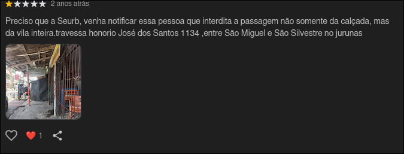
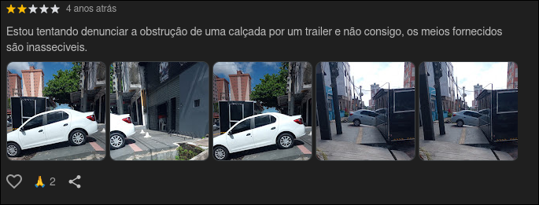
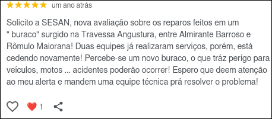
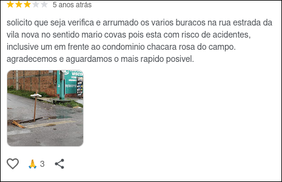

# Sistema Web de Denúncias Urbanas

Projeto do Curso de Desenvolvedor Full Stack do Senac

## 1. Nome do Projeto
Sistema Web de Denúncias Urbanas

## 2. Problema
Muitos problemas urbanos como buracos nas ruas, acúmulo de lixo, iluminação pública quebrada e alagamentos não são reportados de forma eficiente pela população. Em muitos casos, os cidadãos não sabem qual órgão público é responsável ou o processo de denúncia é burocrático.

Usuários tentam reportar problemas por canais não oficiais, como comentários em buscas ou redes sociais, o que reduz a efetividade do atendimento e dificulta o rastreamento das ocorrências.

Isso faz com que diversos problemas permaneçam sem solução por muito tempo, prejudicando a mobilidade, a segurança e a qualidade de vida nas cidades.

### 2.1 Tentativas de denúncia
As imagens abaixo ilustram exemplos reais de tentativas de denúncia realizadas em canais informais, como comentários em buscas ou postagens de redes sociais.

## 3. Objetivo do Projeto
Desenvolver uma aplicação web full stack que permita que cidadãos registrem ocorrências urbanas de forma simples, rápida e organizada, enviando evidências como fotos e vídeos junto com a localização do problema.

O sistema permitirá que essas ocorrências sejam direcionadas aos órgãos públicos responsáveis, facilitando a comunicação entre população e administração pública.

## 4. Público-Alvo
- Cidadãos que desejam reportar problemas urbanos
- Prefeituras e órgãos municipais
- Secretarias de infraestrutura urbana
- Órgãos responsáveis por limpeza, iluminação e manutenção urbana

## 5. Funcionalidades Principais
- Criar conta de usuário
- Enviar denúncia ou ocorrência urbana
- Adicionar fotos ou vídeos do problema
- Capturar geolocalização do local da ocorrência
- Escolher categoria do problema (lixo, buraco, iluminação, alagamento, etc)
- Enviar denúncia de forma anônima ou identificada
- Acompanhar o status da ocorrência

## 6. Requisitos

### 6.1 Requisitos Funcionais
1. **RF001** O sistema deve permitir que o usuário registre uma denúncia urbana com descrição e localização.
2. **RF002** O sistema deve permitir escolher uma categoria para a denúncia, como lixo, buraco, iluminação ou alagamento.
3. **RF003** O sistema deve capturar automaticamente a geolocalização do local da ocorrência.
4. **RF004** O sistema deve permitir anexar fotos ou vídeos à denúncia.
5. **RF005** O sistema deve permitir enviar denúncias de forma anônima ou identificada.
6. **RF006** O sistema deve permitir acompanhar o status da ocorrência após o envio.
7. **RF007** O sistema deve permitir autenticação de usuário e gerenciamento de conta.

### 6.2 Requisitos Não Funcionais
1. **RNF001** A interface deve ser responsiva e acessível em dispositivos móveis e desktops.
2. **RNF002** O tempo de carregamento das páginas principais deve ser inferior a 2 segundos em conexões móveis médias.
3. **RNF003** Os dados do usuário e das denúncias devem ser armazenados de forma segura.
4. **RNF004** O sistema deve oferecer disponibilidade contínua para consultas e envios durante horário de atendimento municipal.

## 7. Tecnologias (Stack)
- **Frontend:** HTML, CSS, JavaScript
- **Backend:** #